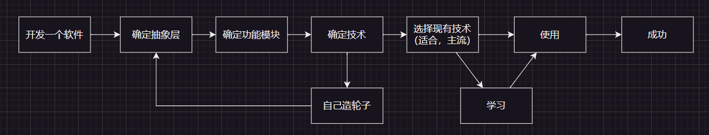
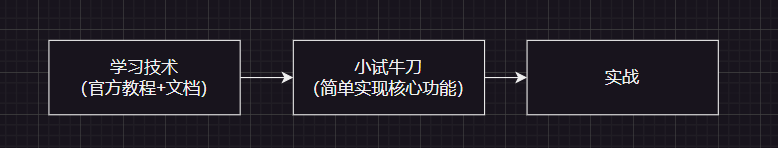

收获：  
1. 开发软件流程
  
2. 解铃还须系铃人1，学一个技术的最好方式就是读官方教程与文档，其他的都是其次，好的博客是辅导书，能加快学习速度，千万不要本末倒置，小心上当吃亏  
3. 解铃还须系铃人2，解决一个问题的最好方式就是在其出处寻求解决办法，是boost库使用的问题，就在boost官网找答案，git clone下来的程序出的问题就在github的issue上找解决方案  
4. 解铃还须系铃人3，中文软件的问题搜百度，英文软件问题搜google，想做国民软件，搜百度
5. 遇到一个问题要对其先进行分析，因为大多数的bug都是较为具体的问题导致的，因此这类问题基本无法检索出来，因此我们要对问题进行处理后再进行检索。  
6. 现有技术抽象层都比较高，底层技术暂时不懂并不影响什么  
7. 使用一个不会的技术流程  

8. 当你觉得这个方式比较麻烦，或者感觉需要自己造轮子的时候，先上网搜搜，肯定有人造好轮子了
9. 任何技术或者是概念都有其应用场景，就比如设计模式，感觉很悬空的概念，但是实际上很贴近现实，举个例子，观察者模式，说白了是什么？类与类之间的通信，当一个类变化了，另一个类会立刻做出反应。因此，一个设计模式其实可以有多种实现方式。就比如上面的观察者模式，最原始的就是靠继承抽象基类去实现，但是现代的方式就可以利用信号和槽机制来实现。所以，在学这类概念之前，我们要搞清楚其应用场景，搞清楚其是要解决什么问题而生的
10. 版本，平台与环境问题不要忽视
11. 遇到bug不要慌，调试器调一调，断点打一打，日志用一用，core看一看  
(调试的话，基本上我习惯打日志，对于流程的东西更清晰。用glog打日志最合理。当然如果core了，可以挂core文件，bt命令back trace可以看到挂掉的函数站)  
12. 不写注释~~死全家~~，谁都一样  
13. 开发客户端和服务端使用的库什么的要保证版本一致  
14. 设计非常重要，要提前设计好类与功能接口等内容，不要等写了之后才发现写的一团乱。在设计的时候考虑耦合性，要方便之后加入功能，要不然每次加入一个功能都要大改代码，甚至小部分重构
15. 取名很重要，变量，类，什么的，只要涉及到取名，就要认真地思考取个什么合适的名字
